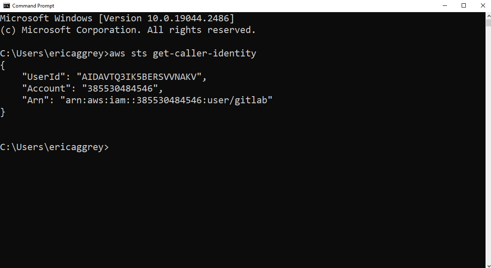
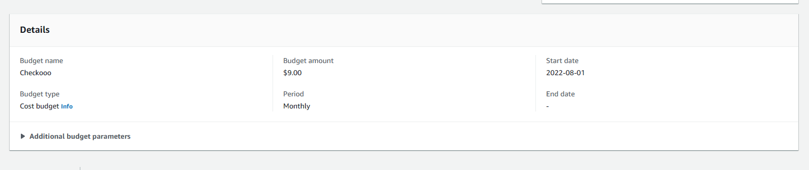
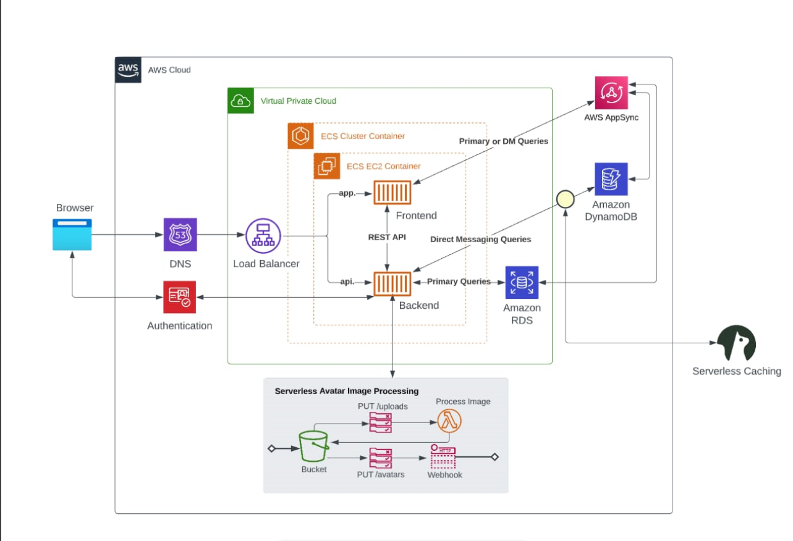

# Week 0 — Billing and Architecture

## Required Homework/Tasks

### Install and Verify AWS CLI 

I have been working on AWS previously so I have the CLI installed on my pc 
proof shown below

 

### Create a Budget

I created my own Budget of 9 usd

 

### Recreate Logical Architectural Deisgn

